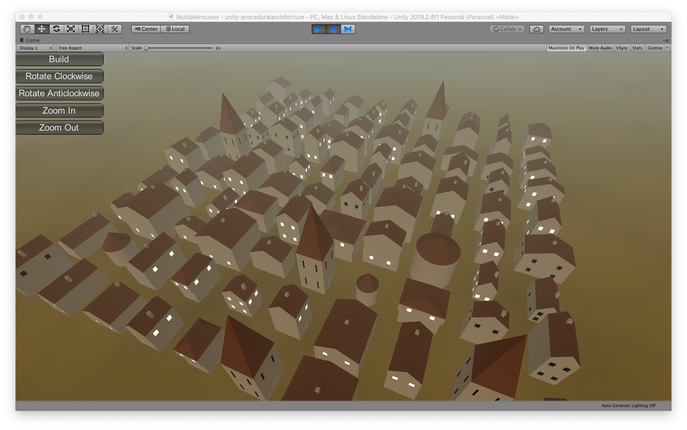

A procedural architecture grammar implementation in Unity3D.

Based on the ideas in [Procedural Modelling of Buildings](http://citeseerx.ist.psu.edu/viewdoc/download?doi=10.1.1.87.8244&rep=rep1&type=pdf)

Example town scene:

